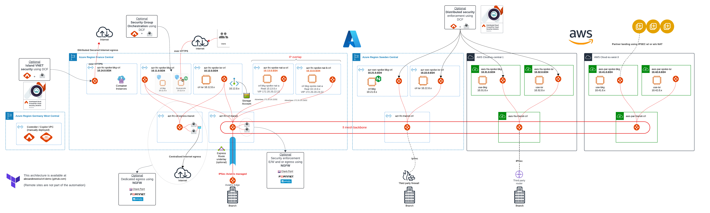

# CRL Demo
All artifacts for demo.

# Context

For that demo, we need :

- An Aviatrix Controller and Copilot deployed in a dedicated vnet.

- Aviatrix transit deployed in two Azure regions and two AWS region :
  - First transit with Firenet / Palo Alto in Azure France Central named frc in the code,
  - Second transit in Azure Sweden Central named swc in the code,
  - Third transit in AWS eu-central-1 named fra in the code,
  - Fourth transit in AWS eu-west-3 named par in the code
  - Standard peering between those four regions over Azure and AWS backbone.
  - Dedicated egress transit with Firenet / Palo Alto is deployed in first region to be used as centralised egress for Azure frc region.

- Aviatrix spoke deployed in each of the above region :
  - One island vnet not connected to transit in the first region,
  - Two vnets, each with an Aviatrix spoke in first region,
  - Two vnets with overlapping CIDRs, each with an Aviatrix spoke in first region,
  - Two vnets, each with an Aviatrix spoke in region two, three and four,
  - Each spoke is peered with its regional transit (except island vnet).
  - Each spoke in Azure frc region (except NAT) is also peered to dedicated egress transit,
  - Each spoke contains a test VM instance accessible via Guacamole jumpbox
  - Guacamole server is deployed in the first spoke of the first region. (Search for the URL to connect in the output after terraform deployment)
  - Guacamole server is also used as a reverse proxy (NGINX) to connect to first application in opposite region across Aviatrix transit.

Diagram of the overall architecture :


# Requirement

- At least one Azure subscription,
- An account being able to create SPN,
- Subscribe to Aviatrix offers :
  - [Aviatrix Cloud Network License Service](https://portal.azure.com/#create/aviatrix-systems.aviatrix-controller-abu-saas) 
  - [Aviatrix Cloud Network Controller](https://azuremarketplace.microsoft.com/en/marketplace/apps/aviatrix-systems.aviatrix-controller?tab=Overview)
  - [Aviatrix Cloud Network CoPilot](https://azuremarketplace.microsoft.com/en/marketplace/apps/aviatrix-systems.aviatrix-copilot?tab=Overview)
  
- Follow the doc to deploy controller and copilot
  - [Getting started Azure](https://docs.aviatrix.com/documentation/latest/getting-started/getting-started-guide-azure.html)
- A workstation that:
  - can access to terraform website,
  - can access the newly deployed controller / copilot public IP address,
  - can access github.com to clone this repository,
  - can execute terraform code.
- A terraform.tfvars containing values like in terraform.tfvars.sample
- Once deployed, perform Firewall Vendor integration
  
# Assumptions

- For fast deploy, we assume demo is deployed as NON highly available. This can be changed easily by updating terraform code
- We deploy Controller and Copilot is same region as first transit in a dedicated vnet

# Deployment and know issues

To be corrected in future release
## Dependencies to be troubleshooted

### Comment the line where we attach to dedicated egress

Comment the below in the 1_azr_r1_spokes.tf to disable Azure first region spokes attachment to dedicated egress
transit_gw_egress = module.transits.region_transit_map["${var.azr_r1_location}"][0]

```
terraform init
terraform apply
```

Once deployed, uncomment both lines to attach spokes to transit.

### Need 3 applies

You may need to run terraform apply once or two more to solve dependency issue with NAT use case as described below :
```
╷
│ Error: failed to configure policies for 'customized_snat' mode due to: rest API edit_gw_customized_snat_config Post failed: Gateway with name dummy does not exist
│
│   with module.azr_r1_spoke_app1_natb_rules.aviatrix_gateway_snat.gw_2[0],
│   on .terraform\modules\azr_r1_spoke_app1_natb_rules\main.tf line 43, in resource "aviatrix_gateway_snat" "gw_2":
│   43: resource "aviatrix_gateway_snat" "gw_2" {
│
╵
╷
│ Error: failed to update DNAT for gateway(name: ) due to: rest API update_dnat_config Post failed: following parameters are required: gateway_name, policy_list
│
│   with module.azr_r1_spoke_app1_natb_rules.aviatrix_gateway_dnat.dnat_rules_gw2[0],
│   on .terraform\modules\azr_r1_spoke_app1_natb_rules\main.tf line 118, in resource "aviatrix_gateway_dnat" "dnat_rules_gw2":
│  118: resource "aviatrix_gateway_dnat" "dnat_rules_gw2" {

```
# Scenario in this demo

## Test inbound connectivity from internet
- NGINX is configured as a reverse proxy in first region to NGINX in second region.
- Test:
  - Browse Guacamole IP using https://w.x.y.z/app
  - Look at NGINX announcement
  
## Internet egress via Palo Alto in Azure frc region aka. Firenet Centralised egress
- Connect to application 1 in Azure frc region to test curl http://monip.org
- Compare with firewall IP address on untrusted interface.

## Test E/W filtering via Firenet and Palo Alto
- Enable inspection of Application 2 vnet in Azure frc region
- Try to ping from Application 1 to Application 2 in Azure frc region
- Browse firewall log to check traffic is going through

## Private Endpoint connectivity test across Aviatrix Data Plane
- Private endpoint deployed in first region, second spoke
- Connected using Linux SBM Client in first region, first spoke
- Test: 
  - connect via Guacamole to application 1 in Azure frc region
  - df -h, 
  - ls /mnt/*storageaccountname*

## Internet egress filtering for island virtual networks
- Browse the Azure Container Instance to check at internet connectivity
- Play with Distributed Cloud Firewall

## Demo overlapping IP across spoke. Kubernetes "cookie-cutter" deployment use case
- Two spokes deployed in first region using same CIDR block.
- Each advertise a unique ip 172.20.20.22/32 and 172.20.20.23/32
- Test:
  - connect via Guacamole to we-Enovia-nat-a and "ip a"
  - connect via Guacamole to we-Enovia-nat-b and "ip a"


